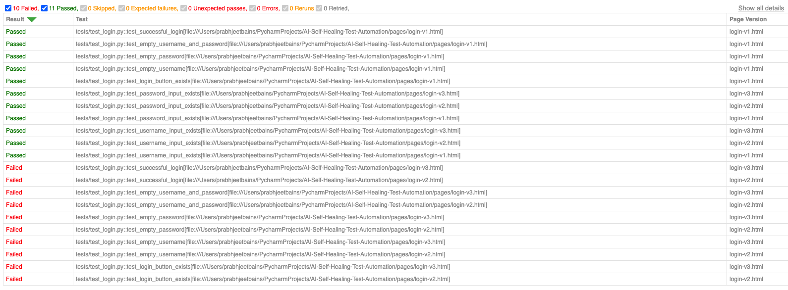
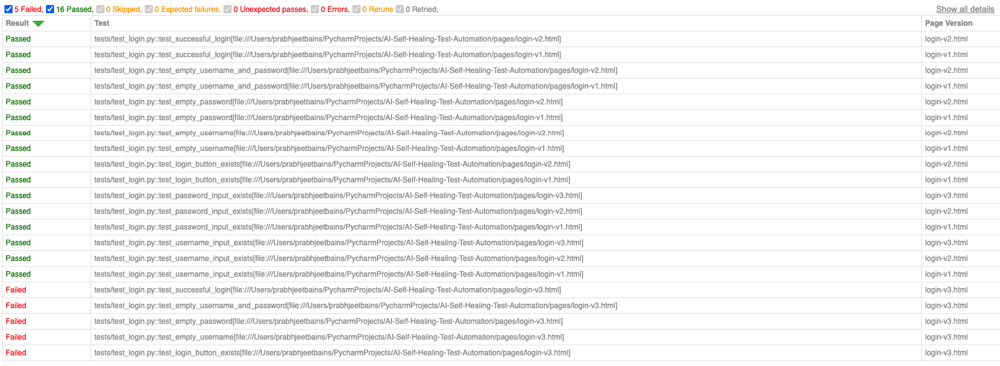

# AI-Powered Self-Healing Automation Framework

This project demonstrates a "Self-Healing" capability where AI identifies and recovers from broken web selectors in real-time, significantly reducing manual test maintenance.

## Key Features
* AI Self-Healing: Intercepts Timeout or SelectorNotFound errors and uses a local LLM (Mistral) to suggest updated selectors based on the current DOM state.
* Smart Wrappers: Custom smart_click, smart_fill, and smart_locator methods that wrap standard Playwright actions with recovery logic.
* Dynamic Reporting: Custom Pytest hooks generate timestamped HTML reports that include metadata for different page versions.
* Local LLM Integration: Uses LangChain and Ollama to run healing logic locally, ensuring data privacy and zero API costs.

## Project Structure
* tests/: Contains parametrized test cases.
* utils/healer.py: The core "brain" containing the LLM prompt and healing logic.
* utils/constants.py: Centralized locators and page URIs to maintain a clean Page Object Model (POM).
* conftest.py: Global configuration for logging, CLI arguments, and HTML reporting.
* pages/: HTML pages used for testing

## Tests
These 7 tests are ran once per each page version (21 total tests)
* test_username_input_exists
* test_password_input_exists 
* test_login_button_exists (expected to fail on 'login-v3.html')
* test_empty_username (expected to fail on 'login-v3.html')
* test_empty_password (expected to fail on 'login-v3.html')
* test_empty_username_and_password (expected to fail on 'login-v3.html')
* test_successful_login (expected to fail on 'login-v3.html')

## Why 3 Different Page Versions?
To demonstrate the self-healing effectiveness, this project includes three versions of the same login page.
This simulates a real-world environment where developers might change IDs, classes, or structures between deployments.

* V1 (Baseline): The original selectors work perfectly → all standard tests pass
* V2 (Minor Changes): The ID for the login button is changed from login-submit to button-submit → standard tests that involve the login button fail in V2
* V3 (Structural Changes): Some elements are removed completely, to demonstrate a genuine bug. This demonstrates the framework's reliability and proving the LLM can distinguish between a missing element (a real bug) and a moved/updated element, effectively avoiding false positives or hallucinations.

## Test Results (Expected Results: 16 PASSED, 5 FAILURES)
Expected Final State: 16 PASSED, 5 FAILURES > Five failures are expected in V3 because the login button is intentionally removed to simulate a regression. This ensures the LLM does not hallucinate a button that doesn't exist.### Standard Test Results (no healing) 11 PASSED, 10 FAILURES
### Standard Test Results
11 PASSED, 10 FAILURES → Tests fail on V2 due to ID changes and on V3 due to missing elements.


### Self-Healing Test Results 16 PASSED, 5 FAILURES
16 PASSED, 5 FAILURES → The framework successfully heals the ID changes in V2. It correctly identifies the missing button in V3 as a failure.


## How the Healing Works
When a selector fails:

1. The smart_locator catches the exception.
2. The framework captures a snapshot of the current Page DOM.
3. The DOM and the broken selector are sent to the local LLM with a specialized prompt.
4. The LLM returns the most likely valid selector (or none if no likely selector was found).
5. The framework retries the action with the new selector and logs the recovery.

## Tech Stack
* Language: Python 3.12+
* Automation: Playwright
* Test Runner: Pytest
* AI Framework/Models: LangChain / Ollama
* Reporting: Pytest-HTML

## Installation & Setup
1. Clone the repository:
```
git clone https://github.com/Prab-Bains/AI-Self-Healing-Test-Automation.git
cd AI-Self-Healing-Test-Automation
```
2. Install dependencies:
```
pip install -r requirements.txt
playwright install
```
3. Install & Run Ollama:
Ensure Ollama is installed and the Mistral model is downloaded:
```
ollama pull mistral
```

## How To Run Tests
### Prerequisite
Ensure Ollama is running
```
ollama serve
```

### Switches
```
--heal            Run tests with self-healing logic using LLM
--no-report       Run tests with no report generated at the end
--headed          Run tests with a visible GUI
```

### Standard Run (No Healing):
```
pytest
```
### Run with AI Self-Healing Enabled:
```
pytest --heal
```

### Run without generating an HTML report:
```
pytest --no-report
```
or
```
pytest --heal --no-report
```

## Future Improvements
1. Better Performance & Speed
Stronger AI Models: I currently use Mistral-7B because of my local hardware limits. Switching to more powerful models (like GPT-4 or Llama-3 70B) would make the "healing" even more accurate for complex applications.

2. Visual Healing
Right now, the LLM "reads" the code (HTML) to find fixed elements. A possible upgrade could include Visual Healing, where the LLM looks at screenshots of the page. This would allow the framework to find buttons based on how they look and where they are on the screen, even if the code behind them changes completely.

3. Permanent Fixes (Auto-Updating Code)
Instead of having the LLM fix the same broken link every time the test runs, the framework could automatically update the code. It could create a "Pull Request" that replaces the old, broken selector with the new one in my constants.py file, saving time and computing power.

4. Smarter Data Processing
To save memory and speed things up, the data passed to the LLM could be "cleaned". By removing unnecessary parts of the page code, the AI can focus only on the buttons and inputs that matter.